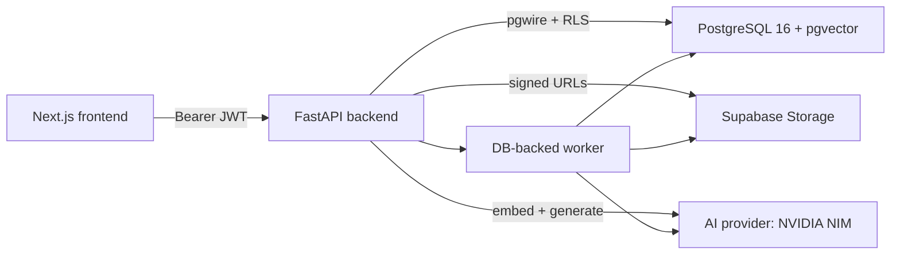
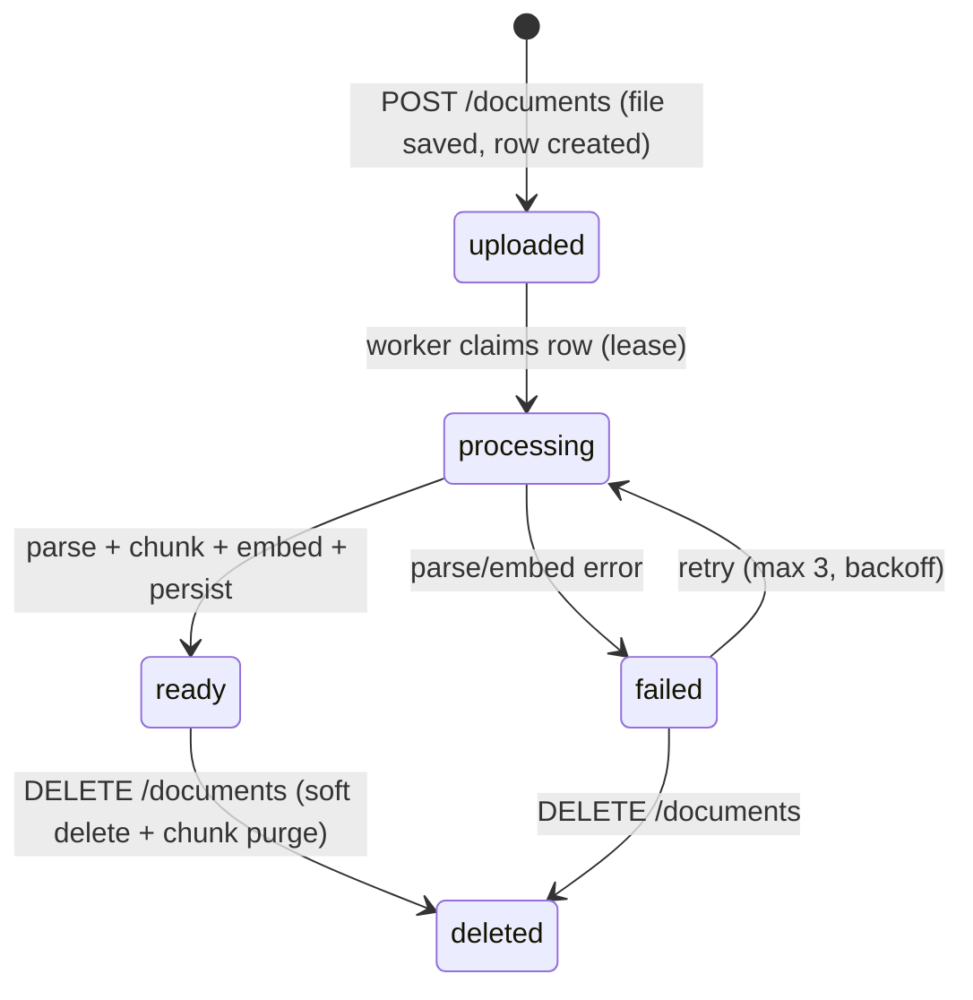
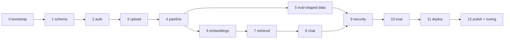

# Contextly

**Multi-tenant AI document platform** — upload PDFs, ask questions, get grounded answers
with verifiable sources. A complete RAG stack: streaming chat, source citations,
multi-tenancy enforced at the database, and a CI-gated retrieval evaluation.

The full tech blueprint lives in **[docs/](docs/README.md)** — every architectural
decision documented before the code was written.

## What it does (demo flow)

```
Upload a PDF  →  async ingestion (parse → chunk → embed → pgvector)
                                     ↓
                       Chat with citations
```

1. **Upload** — a PDF (≤ 10 MB) is validated and stored tenant-scoped; an
   `uploaded` document record is created synchronously.
2. **Process** — a DB-backed worker claims the row (lease + heartbeat), parses pages,
   chunks with page awareness, embeds with the AI provider, and persists pgvector rows
   (chunk ~500 tokens / ~50 overlap, docs/ingestion.md).
3. **Chat** — ask a question; the backend embeds it, searches the conversation's ready
   documents (top-K 6, L2, HNSW), streams an answer from the LLM, and attaches the
   sources (document, page, chunk, score) to the assistant message (docs/rag.md,
   docs/chat.md).

Every answer is grounded in retrieved excerpts, and every source is clickable back to
the exact page.

## Architecture

Modular monolith: Next.js frontend, FastAPI backend (which also runs the DB-backed
worker), and PostgreSQL + pgvector. Supabase provides Auth + Storage, and an AI
provider (NVIDIA NIM default) does embeddings + generation — both behind thin
`AIProvider` / `StorageProvider` abstractions switched by environment
(`AI_PROVIDER`, `STORAGE_PROVIDER`), so dev, test, and prod run the same code path.

**System topology** (docs/architecture.md):



**Ingestion lifecycle** (docs/ingestion.md) — Postgres is the queue; no Redis/Celery:



**RAG pipeline** (docs/rag.md):

```mermaid
flowchart LR
  Q[User question] --> PRE[Preprocess: trim, cap length]
  PRE --> EQ[AIProvider.embed question]
  EQ --> RET[pgvector HNSW top-K search]
  RET --> FILT[filter: conversation's ready documents only]
  FILT --> CTX[build context: numbered snippets + metadata]
  CTX --> LLM[AIProvider.generate with system prompt]
  LLM --> ANS[answer]
  ANS --> SRC[attach sources]
  SRC --> P[persist assistant message]
```



**Roadmap dependency graph** (docs/roadmap.md) — 13 phases, $0 stack, each ending in a
working increment:



## Stack decision table

Locked MVP decisions (full table: docs/README.md):

| Topic | Decision |
|---|---|
| Frontend | Next.js + TypeScript + Tailwind (App Router) |
| Backend | FastAPI (Python) — Python for RAG/document processing |
| Database | PostgreSQL 16 + pgvector (Supabase hosted or self-hosted via `DATABASE_URL`) |
| Auth | Supabase Auth (JWT) |
| Storage | Supabase Storage via a `StorageProvider` interface |
| Async processing | DB-backed worker (polling + lease/heartbeat) — **no Redis/Celery** |
| Embeddings / LLM | NVIDIA NIM default (`AIProvider` abstraction, OpenRouter switchable) |
| Retrieval | pgvector HNSW, L2, top-K 6, chunk ~500/~50 (docs/rag.md §2, tuned Phase 12) |
| Chat | Persistent conversations + multi-doc selection + **SSE streaming from MVP** |
| Multi-tenancy | RLS on every tenant table + session-scoped queries + signed URLs (docs/multi-tenancy.md) |
| Deployment | $0 tiers: Vercel + Render + Supabase (docs/deployment.md) |

## Run locally (3 commands)

Requires Docker with Compose v2. **No accounts, keys, or credentials** — dev mode uses
the `fake` AI provider, local storage, and dev auth (docs/local-dev.md).

```bash
cp .env.example .env          # dev-safe defaults
docker compose up --build     # db :5432 · backend :8000 · frontend :3000
make migrate                  # apply numbered SQL migrations
```

Verify with `make test` (backend pytest) or open http://localhost:3000.

Quality gates: `make lint` (ruff + mypy · tsc + eslint), `make eval` (RAG eval +
recall gate), `make eval-sweep` (Phase 12 parameter sweep).

## Deployment (live)

The $0 stack ships on **Vercel** (Next.js) + **Render** (FastAPI web + worker,
`render.yaml`) + **Supabase** (Auth, Storage, Postgres+pgvector), with NVIDIA NIM (or
OpenRouter) as the AI provider. Migrations run as a Render `preDeployCommand` with a
separate `MIGRATION_DATABASE_URL`; deploy blockers reject unsafe combinations
(`STORAGE_PROVIDER=local` / `AUTH_MODE=dev` outside dev).

- Live app: `https://<app>.vercel.app` (frontend) + `https://<backend>.onrender.com` (API)
- Operator runbook + post-deploy verification checklist: docs/deployment.md §9–10
- Beginner credential walkthrough: docs/deployment-walkthrough.md

> Free-tier reality: Render sleeps after ~15 min idle and Supabase pauses after ~7
> days without activity — expect a wake-up delay on cold visits (mitigated by a
> scheduled `/healthz` hit; trade-offs live in docs/tradeoffs.md).

## Tests & evaluation

- **309 tests** in the backend + eval suites (pytest), including:
  - 10-test **multi-tenancy matrix** (RLS isolation) that must pass in CI
    (docs/roadmap.md Phase 9, docs/multi-tenancy.md)
  - RAG evaluation harness (`eval/`) over 60 committed queries on 5 seed PDFs
  - Frontend `tsc` + `eslint` + `next build` in CI (docs/deployment.md §5–8)
- **Retrieval gate**: `recall@6 >= 0.85` (document **and** page coverage, both
  variants — docs/testing.md §6) fails the build on regression. Current:
  recall@6 = 1.000, MRR = 1.000 (docs: [eval/reports/rag-eval.md](eval/reports/rag-eval.md)).
- **Phase 12 tuning** (docs/tuning.md): swept chunk size, overlap, top-K, and
  `ef_search` around the defaults; the defaults are kept — every candidate hit the
  recall ceiling, none beat the default's perfect document MRR while improving page
  coverage. Sweep data: [eval/reports/tuning-sweep.md](eval/reports/tuning-sweep.md).

## What's next / known limits (honest section)

In scope for the MVP roadmap (phases 0–12), now shipped. Everything below is
**explicitly deferred or accepted** (docs/mvp-scope.md, docs/security.md §7,
docs/tradeoffs.md):

- **Free-tier pitfalls**: cold starts (Render sleep / Supabase pause), service limits,
  provider rate limits. Accepted for a $0 demo story.
- **Accepted risks**: prompt injection is mitigated (delimiters + system instruction)
  but inherent to RAG; rate limiting is per-process; `pypdf` is not a hardened parser
  (PDF-only + size caps); no SSO/2FA; the Supabase service-role key must never reach
  the browser bundle.
- **Deferred features** (deliberately not in MVP): re-indexing of `ready`
  documents (failed docs can be re-processed — `PATCH /documents/{id}/reprocess`),
  hybrid search, reranking, query rewriting, Redis/Celery queues, async eval
  dashboards, hard-delete semantics (soft delete keeps source snapshots consistent).
- **Tuning**: chunk/top-K defaults validated at the eval ceilings of the committed
  corpus; real-DB `ef_search` latency probing and real-provider answer-quality sweeps
  are documented opt-ins (docs/tuning.md) for when the corpus grows.

## Repository layout

```
backend/         FastAPI app (app/), tests, Dockerfile
frontend/        Next.js App Router (app/, components, lib)
infrastructure/  numbered SQL migrations + docker fragments
eval/            RAG eval harness, datasets, fixtures, sweep driver + reports
docs/            architecture blueprint (source of truth), deployment, runbook
specs/           one spec/plan/tasks per roadmap phase (001–013) — the build's history
designs/         design system tokens + prototype references
```

## CI / CD

Push and PRs run `.github/workflows/ci.yml`: backend (ruff + mypy + pytest against a
Postgres 16 service container including the multi-tenancy matrix and the hermetic eval
gate) and frontend (tsc + eslint + next build), fail fast.

Built phase-by-phase, spec-first: every change traces to a spec, plan, and tasks in
`specs/` and a definition of done in `docs/roadmap.md` — see `AGENTS.md` for the
workflow.