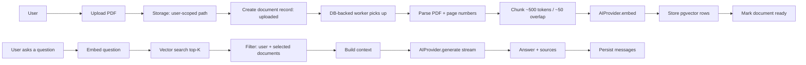
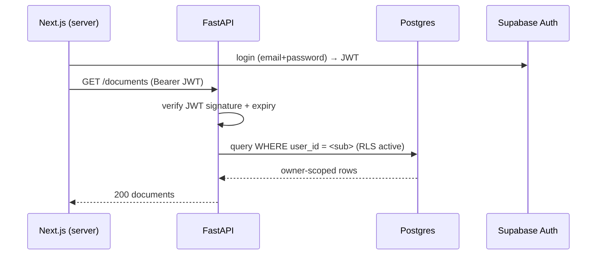

# Architecture

## 1. System overview

Contextly is a **modular monolith**: a Next.js frontend, a FastAPI backend, and a
PostgreSQL database that carries both relational data and pgvector embeddings. Two
pre-existing/external boxes complete the system: an Auth/Storage platform (Supabase
for MVP) and an AI provider (NVIDIA NIM for MVP). All external access flows through
two thin abstractions (`AIProvider`, `StorageProvider`).

```
┌──────────────────────────────┐
│  Next.js frontend            │
│  · /login /dashboard /chat   │
│  · server-side API calls     │
│  · streaming chat UI         │
└──────────────┬───────────────┘
               │ HTTPS / Bearer JWT
┌──────────────▼───────────────┐        ┌───────────────────────┐
│  FastAPI backend             │        │  Supabase (MVP)       │
│  · REST API /api/v1          │◄──────►│  · Auth (JWT)         │
│  · auth dependency (JWT)     │        │  · Storage (files)    │
│  · document pipeline         │        └───────────────────────┘
│  · retrieval + RAG           │
│  · DB-backed worker          │        ┌───────────────────────┐
│  · structured logs           │        │  AI provider (MVP)    │
└──────────────┬───────────────┘        │  · NVIDIA Build —     │
               │                        │    embed + generate   │
┌──────────────▼───────────────┐        └───────────────────────┘
│  PostgreSQL 16 + pgvector    │
│  · profiles/documents/...    │
│  · document_chunks.embedding │
│  · HNSW index, RLS enabled   │
└──────────────────────────────┘
```

### Data flow

The end-to-end flow the product must support:



## 2. Component responsibilities

### Frontend (Next.js)
- Pages: `/login`, `/register`, `/dashboard`, `/documents`,
  `/documents/:id`, `/chat`, `/chat/:conversation_id`, `/settings`.
- Server-side calls to the FastAPI API using the user's JWT (never exposed to the browser).
- Streaming chat via SSE; optimistic message display; loading/empty/error states.
- Selected-document management per conversation.

### Backend (FastAPI)
- Exposes `/api/v1` REST endpoints (see [api.md](api.md)).
- Enforces authentication (JWT validation) and authorization (owner checks) at the API layer.
- Runs the document ingestion pipeline and the RAG pipeline.
- Hosts the **DB-backed worker** as an in-process background task (or a second worker process in deployment).
- Structured logging, metric counters, central error handling.

### PostgreSQL + pgvector
- Source of truth for profiles, documents, chunks (+ embeddings), conversations, messages.
- Enforces **Row Level Security** so untrusted query paths cannot cross tenants.
- HNSW index for fast approximate nearest-neighbour search.

### Supabase (Auth + Storage, MVP)
- GoTrue JWT issuance/validation (backend validates signatures, does not call Supabase per request).
- Object storage for uploaded files under `/{user_id}/...` prefixes with per-user policies and short-lived signed URLs.

### AI provider (NVIDIA NIM, MVP)
- Embedding of chunks and questions.
- Generation of RAG answers (streaming).
- Swappable via `AI_PROVIDER` env var (NVIDIA → OpenRouter) without touching RAG logic
  (see [ai-providers.md](ai-providers.md)).

### Document processing (backend worker)
- Polls for `uploaded` documents, claims them with a lease, parses → chunks → embeds → persists → marks `ready`.
- Handles retries with backoff; marks `failed` with a stored error after retries are exhausted.

### RAG pipeline (backend)
- Preprocesses the question → embeds → filters by user + selected documents → top-K → builds context → LLM → returns answer + sources.

### Chat system (backend + frontend)
- Persistent conversations tied to a set of selected documents.
- Stores user and assistant messages; assistant messages carry source metadata.

## 3. Responsibilities at each layer (from user to disk)

| Step | Component | Responsibility |
|---|---|---|
| Authenticate | Supabase → FastAPI dependency | Validate JWT, resolve user id |
| Upload | Frontend → FastAPI → Supabase Storage | Validate type/size, store under user prefix, create record |
| Process | Backend worker | Parse → chunk → embed → persist |
| Store vectors | pgvector | Store embeddings + metadata, HNSW search |
| Retrieve | Backend RAG | Filter by tenant + selected docs, top-K |
| Answer | AI provider | Generate from context, stream |
| Persist | Postgres | Conversation + messages + sources |

## 4. Request lifecycle (auth)



## 5. Key ordering constraints

- Upload completes synchronously (short-lived file write + DB insert); everything after is async.
- A document becomes searchable only when status = `ready`.
- All reads of chunks/vectors are scoped by `user_id` at query time in addition to RLS.