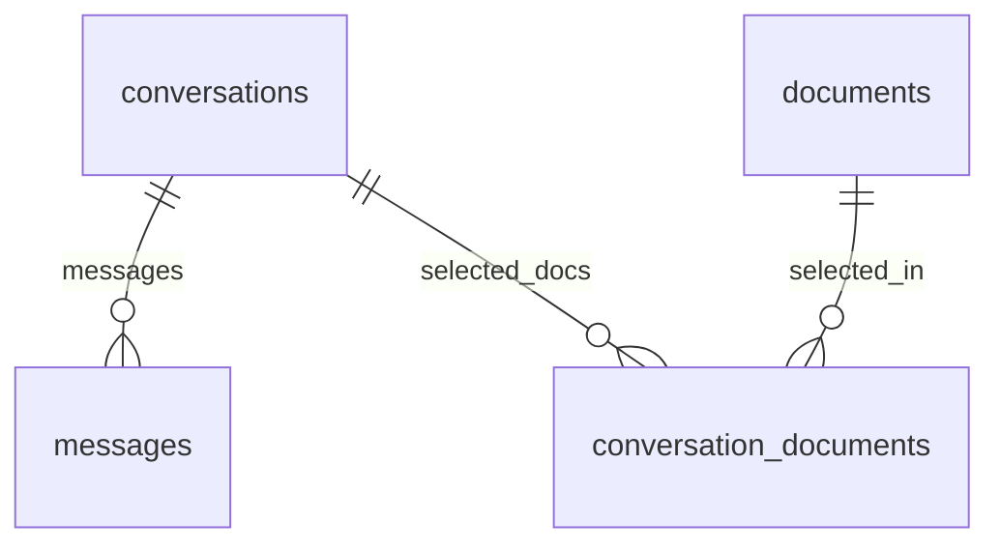
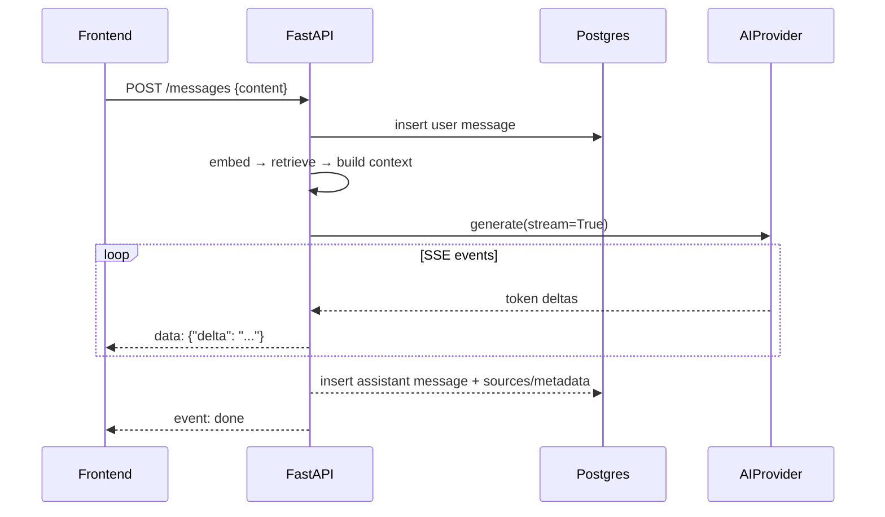

# Chat Architecture

## 1. Data model



- `conversations(user_id, title, pinned, archived_at, created_at, updated_at, deleted_at)`
- `conversation_documents(conversation_id, document_id)` — the document selection set.
- `messages(conversation_id, role, content, sources, token counts, timings, created_at)`

Rules:
- A message belongs to exactly one conversation; its tenant is inherited through the
  conversation (RLS policy subqueries handle this).
- Assistant messages persist `sources` (see [rag.md](rag.md) §5) so citations survive
  document deletion.
- Deleting a conversation cascades to messages and its `conversation_documents` rows.

## 2. Document selection

A conversation has an explicit allow-list of documents. The RAG retrieval filter becomes:

```
d.user_id = current_user
AND d.status = 'ready'
AND d.id IN (conversation_documents of this conversation)
```

Behavior rules:
- Only documents owned by the current user and in `ready` status can be selected.
- Selecting a document after a conversation exists simply inserts a
  `conversation_documents` row — it immediately enlarges retrieval scope (no re-embed).
- Deselecting deletes the row — retrieval scope shrinks immediately.
- Deleting a document removes it from every conversation's selection implicitly
  (FK cascade), but historical message `sources` snapshots remain intact.

## 3. API surface (see [api.md](api.md) for full details)

- `POST /conversations` — create (optional `title`, optional `document_ids`)
- `GET /conversations` — list (pinned first, newest; `?archived=true` lists archived)
- `GET /conversations/{id}` — detail + selected document ids
- `PATCH /conversations/{id}` — rename / update selection / pin / archive
- `DELETE /conversations/{id}` — delete
- `GET /conversations/{id}/messages` — history (oldest first, paginated)
- `POST /conversations/{id}/messages` — send a question → SSE stream of the answer

## 4. Message flow (send → stream)



- The client connects to an SSE endpoint; the backend accumulates the final text and
  persists it exactly once at stream end (idempotent: message id in the stream header).
- Client shows the assistant message optimistically, marked "…" until `done`.
- Token counts + timings stored on the assistant message for logs/metrics.

### 4.1 Multi-turn context (Phase 13)

`services/chat_context.py` adds conversation memory to the send pipeline (spec:
`specs/014-chat-multi-turn-context/`). Both windows are fetched with RLS-scoped
queries against the caller's own conversation and exclude the just-persisted
current message.

1. **Retrieval-query rewrite (US1):** a bounded window of prior messages
   (`chat_rewrite_max_messages`, default 6; `chat_rewrite_max_tokens`, default
   1500) is sent with the question to the LLM ("restate the latest question as a
   standalone question, resolving references"). The rewritten query is embedded
   and retrieved; any failure — provider error or empty/malformed output —
   falls back to the raw question with a `rewrite=fallback` marker.
   Disabled entirely via `chat_rewrite_enabled=false` (`rewrite=disabled`).
2. **Generation history window (US2):** a second bounded window
   (`chat_context_max_messages`, default 12; `chat_context_max_tokens`, default
   2000) is rendered as a `Conversation history:` block between the excerpts and
   the current question, wrapped in `<conversation_history>` delimiters. Truncation
   keeps newest messages first, dropping oldest until the token budget fits; the
   newest message is always kept — a single oversized message is never split and
   never leaves the window empty.
3. **Logging (US3):** every non-replayed send logs `chat multi-turn | user=… |
   conversation=… | rewrite=<marker> | rewritten_query=… | window_messages=… |
   window_tokens=…` (`n/a` markers when there is no history yet).

Settings live on `app.state.settings` (create_app) so tests can inject a Settings
object; `chat_context` knobs are documented in §6 below.

## 5. Streaming decision

Streaming is **in the MVP**. It is the single biggest contributor to a chat UI feeling
like a real product, and FastAPI's `StreamingResponse` + SSE makes it cheap. Fallback:
if the provider reports no streaming support, return one SSE event with the full answer
— the frontend never needs to know.

## 6. Edge cases

- Empty conversation (no selected docs) → API rejects question with a clear 400:
  "Add documents to this conversation first."
- Zero retrieved chunks → "no relevant documents found" answer (see [rag.md](rag.md) §7).
- Provider error during stream → SSE error event, assistant message persisted with
  partial content + `status` marker shown in UI.
- Question length cap (e.g. 4000 chars) → 422 with message.
- Renaming: default title is "New conversation"; auto-renamed to first question
  (truncated) if user hasn't set one — nice UX, trivial to implement. Auto-rename
  never overwrites a user-set title.
- Multi-turn knobs (Phase 13): `chat_rewrite_enabled`, `chat_rewrite_max_messages`
  (6), `chat_rewrite_max_tokens` (1500), `chat_context_max_messages` (12),
 `chat_context_max_tokens` (2000). An empty or malformed rewrite result falls
 back to the raw question; empty windows short-circuit both paths (no LLM call,
 raw query, no history block).

## 7. Conversation management (pin / archive / delete)

- **Delete** soft-deletes (`deleted_at`); the conversation and its messages become
  unreachable (404 on every endpoint) — the app forgets the context.
- **Pin** (`pinned=true`) floats the conversation above all others in the default
  list; unpin restores recency ordering.
- **Archive** (`archived=true`) hides the conversation from the default list;
  `GET /conversations?archived=true` lists archived ones for restore
  (`archived=false`). Direct links still open archived conversations.
- Messages sent to an archived conversation (direct link) are persisted normally;
  the conversation stays archived.