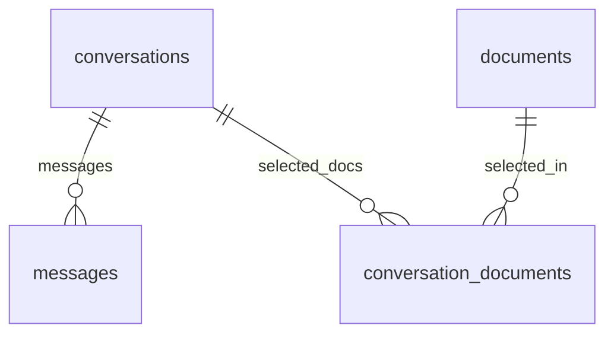
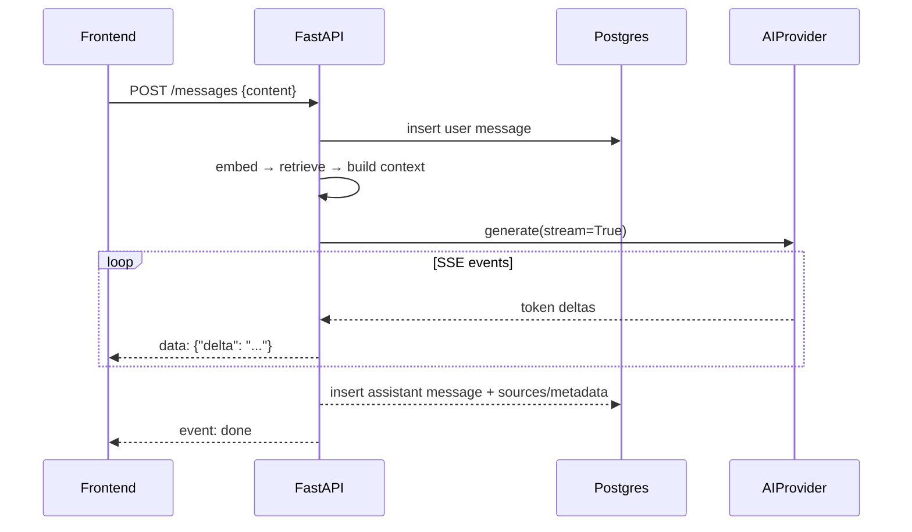

# Chat Architecture

## 1. Data model



- `conversations(user_id, title, created_at, updated_at, deleted_at)`
- `conversation_documents(conversation_id, document_id)` — the document selection set.
- `messages(conversation_id, role, content, sources, token counts, timings, created_at)`

Rules:
- A message belongs to exactly one conversation; its tenant is inherited through the
  conversation (RLS policy subqueries handle this).
- Assistant messages persist `sources` (see [rag.md](rag.md) §5) so citations survive
  document deletion.
- Deleting a conversation cascades to messages and its `conversation_documents` rows.

## 2. Document selection

A conversation has an explicit allow-list of documents. The RAG retrieval filter becomes:

```
d.user_id = current_user
AND d.status = 'ready'
AND d.id IN (conversation_documents of this conversation)
```

Behavior rules:
- Only documents owned by the current user and in `ready` status can be selected.
- Selecting a document after a conversation exists simply inserts a
  `conversation_documents` row — it immediately enlarges retrieval scope (no re-embed).
- Deselecting deletes the row — retrieval scope shrinks immediately.
- Deleting a document removes it from every conversation's selection implicitly
  (FK cascade), but historical message `sources` snapshots remain intact.

## 3. API surface (see [api.md](api.md) for full details)

- `POST /conversations` — create (optional `title`, optional `document_ids`)
- `GET /conversations` — list (newest first)
- `GET /conversations/{id}` — detail + selected document ids
- `PATCH /conversations/{id}` — rename / update selected documents
- `DELETE /conversations/{id}` — delete
- `GET /conversations/{id}/messages` — history (oldest first, paginated)
- `POST /conversations/{id}/messages` — send a question → SSE stream of the answer

## 4. Message flow (send → stream)



- The client connects to an SSE endpoint; the backend accumulates the final text and
  persists it exactly once at stream end (idempotent: message id in the stream header).
- Client shows the assistant message optimistically, marked "…" until `done`.
- Token counts + timings stored on the assistant message for logs/metrics.

## 5. Streaming decision

Streaming is **in the MVP**. It is the single biggest contributor to a chat UI feeling
like a real product, and FastAPI's `StreamingResponse` + SSE makes it cheap. Fallback:
if the provider reports no streaming support, return one SSE event with the full answer
— the frontend never needs to know.

## 6. Edge cases

- Empty conversation (no selected docs) → API rejects question with a clear 400:
  "Add documents to this conversation first."
- Zero retrieved chunks → "no relevant documents found" answer (see [rag.md](rag.md) §7).
- Provider error during stream → SSE error event, assistant message persisted with
  partial content + `status` marker shown in UI.
- Question length cap (e.g. 4000 chars) → 422 with message.
- Renaming: default title is "New conversation"; auto-renamed to first question
  (truncated) if user hasn't set one — nice UX, trivial to implement.