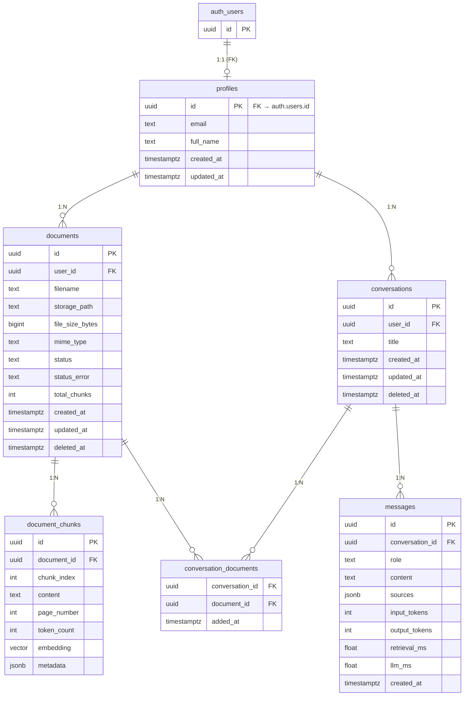

# Database Architecture

PostgreSQL 16 + `pgvector`. All timestamps are `timestamptz` UTC. All ids are
`uuid` (v7 client-generated where convenient, or DB-generated). Row Level
Security is enabled on every tenant-scoped table (see
[multi-tenancy.md](multi-tenancy.md)).

## 1. ERD



## 2. Schema (DDL)

```sql
create extension if not exists vector;

-- 1:1 with auth.users (Supabase) or app users
create table profiles (
  id         uuid primary key references auth.users(id) on delete cascade,
  email      text not null,
  full_name  text,
  created_at timestamptz not null default now(),
  updated_at timestamptz not null default now()
);

create type document_status as enum
  ('uploaded', 'processing', 'ready', 'failed', 'deleted', 'superseded');

create table documents (
  id              uuid primary key default gen_random_uuid(),
  user_id         uuid not null references profiles(id) on delete cascade,
  filename        text not null,
  storage_path    text not null,          -- e.g. {user_id}/docs/{document_id}.pdf
  file_size_bytes bigint not null check (file_size_bytes > 0),
  mime_type       text not null default 'application/pdf',
  status          document_status not null default 'uploaded',
  status_error    text,                   -- last failure reason (for status='failed')
  total_chunks    int,
  created_at      timestamptz not null default now(),
  updated_at      timestamptz not null default now(),
  deleted_at      timestamptz             -- soft delete
);

create index documents_user_idx on documents (user_id);
create index documents_user_status_idx on documents (user_id, status) where deleted_at is null;

-- Phase 12 dedupe (docs/ingestion.md §5): at most one active row per
-- (user_id, filename). 'superseded' and deleted rows don't count as active,
-- so a name is reusable once the version holding it is replaced or removed.
-- (Migration 0005 names the pre-existing statuses because a value added to
-- an enum is only usable after its transaction commits.)
create unique index documents_active_filename_idx
  on documents (user_id, filename)
  where deleted_at is null and status in ('uploaded', 'processing', 'ready', 'failed');

create table document_chunks (
  id          uuid primary key default gen_random_uuid(),
  document_id uuid not null references documents(id) on delete cascade,
  chunk_index int  not null,
  content     text not null,
  page_number int,                          -- null if parser can't detect pages
  token_count int,
  embedding   vector(1024),                 -- MUST match embedding model dims
  metadata    jsonb not null default '{}'::jsonb,
  unique (document_id, chunk_index)
);

-- NB: index created after data or with a parallel index build; see pgvector design.
create index chunks_embedding_hnsw
  on document_chunks using hnsw (embedding vector_l2_ops)
  with (m = 16, ef_construction = 64);

create index chunks_document_idx on document_chunks (document_id);

create table conversations (
  id         uuid primary key default gen_random_uuid(),
  user_id    uuid not null references profiles(id) on delete cascade,
  title      text not null default 'New conversation',
  created_at timestamptz not null default now(),
  updated_at timestamptz not null default now(),
  deleted_at timestamptz
);

create index conversations_user_updated_idx on conversations (user_id, updated_at desc) where deleted_at is null;

-- A conversation only queries chunks of these documents.
create table conversation_documents (
  conversation_id uuid not null references conversations(id) on delete cascade,
  document_id     uuid not null references documents(id) on delete cascade,
  added_at        timestamptz not null default now(),
  primary key (conversation_id, document_id)
);

create index conversation_documents_document_idx on conversation_documents (document_id);

create table messages (
  id              uuid primary key default gen_random_uuid(),
  conversation_id uuid not null references conversations(id) on delete cascade,
  role            text not null check (role in ('user', 'assistant')),
  content         text not null,
  sources         jsonb,        -- assistant only; see §5
  input_tokens    int,
  output_tokens   int,
  retrieval_ms    int,
  llm_ms          int,
  created_at      timestamptz not null default now()
);

create index messages_conversation_created_idx on messages (conversation_id, created_at);
```

Notes:
- `profiles` is the tenant table. `auth.users` is provided by Supabase Auth in MVP.
- `documents.deleted_at` supports soft delete (hide + remove from search). Chunks are
  hard-deleted by the API when a document is deleted.
- `documents.status = 'superseded'` marks a replaced version (Phase 12): the row
  stays in the docs table but is excluded from retrieval/context/worker claims.
  Replace is reversible (docs/ingestion.md §7): `superseded_from` remembers the
  pre-replace status and `replaces_document_id` links a replacement to the row
  it superseded (migration 0005, index `documents_replaces_idx`). The
  `documents_replace_resolution` trigger (migration 0005) finalizes the
  supersede (chunk purge) when a replacement reaches `ready`, and restores the
  old status + chunks when it `fails` (the failed row then leaves the active
  set) or is deleted — so the active-filename index always allows exactly one
  active row per name.
- No `updated_at` on chunks — immutable after write; chunk metadata edits are re-inserts.

### Local-dev auth shim & runtime role

`0001_init.sql` runs on self-hosted Postgres (compose, no Supabase) *and* Supabase-hosted
Postgres. Because the local image has no `auth` schema, the migration creates a
dev-compatible shim that no-ops against the real Supabase schema:

- `auth.users (id uuid primary key)` via `create table if not exists` (Supabase's real
  `auth.users` already exists there — untouched).
- `auth.uid()` via `create or replace function` using Supabase's current cloud
  implementation (`coalesce` over `request.jwt.claim.sub` and the `request.jwt.claims`
  JSON fallback). RLS policies use `auth.uid()`; with no claim set it returns NULL and
  every policy fails closed.

The same migration creates `contextly_app`, a LOGIN role with no `BYPASSRLS`, granted
`CONNECT`, `USAGE`, SELECT/INSERT/UPDATE/DELETE on the application tables, and `ALTER
DEFAULT PRIVILEGES` so future tables inherit the grants (see
[multi-tenancy.md](multi-tenancy.md) §2). Runtime queries must use this role; the
superuser is only for migrations/admin.

## 3. pgvector design

- Column: `embedding vector(1024)` — dimension **must equal the locked embedding model's
  output** (`nvidia/bge-m3`, 1024). Changing model → table migration + full re-embedding.
- Distance: `L2` (`vector_l2_ops`). Cosine is fine too; pick L2 and keep it consistent
  with the similarity function used in the RAG layer (`1 - distance`).
- Index: **HNSW** (`m=16, ef_construction=64`). For tens of thousands of rows per
  user, HNSW gives query latency in single-digit ms without tuning. IVFFlat is the
  alternative if HNSW memory becomes a concern (unlikely at portfolio scale).
- `ef_search`: default 40 at query time (tunable); higher = better recall, slower.
- Per-user isolation in search: filter chunks by `document_id IN (…)` where the
  document set is already user- and conversation-scoped (see [rag.md](rag.md)).
- Create the HNSW index **after** bulk loading chunks (or `CREATE INDEX … WITH` in
  parallel) to avoid slow initial loads.

## 4. Additional considerations

- **Migrations:** SQL files + a tiny migration runner (e.g. Alembic or plain
  `schema.sql` + numbered patches). Keep them in `infrastructure/migrations/`.
- **No overengineering:** no shadow tables, no event log, no audit tables in MVP.
  `messages.sources` snapshot is enough for source attribution.
- **Seed data:** an `eval` user + a handful of eval PDFs (see [testing.md](testing.md))
  can be seeded via a script.
