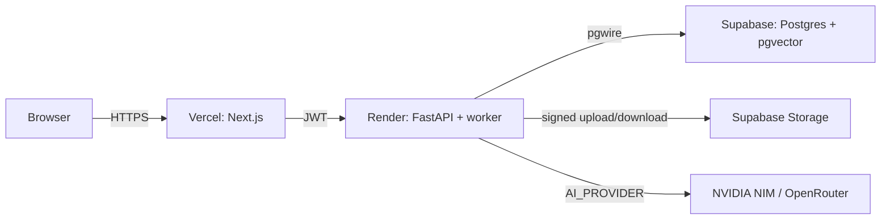

# Deployment

## 1. Target: $0 (MVP) with an escape hatch

| Component | MVP ($0) | Fallback if free tier fails |
|---|---|---|
| Frontend | Vercel Hobby (Next.js) | Cloudflare Pages / any static host; or a VPS |
| Backend | Render free web service (FastAPI + worker) | Railway free tier; or VPS (`~$5-6/mo`, Hetzner) |
| PostgreSQL + pgvector | Supabase free (hosted, paused after 7 days inactivity) | Neon free; or Postgres on the VPS |
| Auth | Supabase Auth (bundled) | DIY JWT (SQLAlchemy users + password hashing) |
| Storage | Supabase Storage free | Backblaze B2 (10 GB free); or local disk on VPS |
| AI | NVIDIA Build free endpoints | OpenRouter free models; swap via `AI_PROVIDER` |
| Domain + HTTPS | none needed in MVP (Vercel/Render give `*.onrender.com` + `*.vercel.app` with TLS) | `$10/yr` domain + Caddy/Traefik on VPS |

**Escape hatch:** every service behind an abstraction (see
[ai-providers.md](ai-providers.md)) or a plain env var (`DATABASE_URL`). If the demo
needs reliable uptime, the VPS path is one compose file away — no code changes.

## 2. Target topology (MVP)

- Next.js runs server-side API calls; the browser never holds backend credentials.
- FastAPI and the DB-backed worker run as **two processes in one web container**
  (Render's free tier has no background-worker service type): the Dockerfile CMD
  starts `python -m app.worker` in the background and uvicorn in the foreground.
  A wake cron (free scheduler, §9 step 8) keeps the free web service from spinning
  down, so the worker keeps polling. Cold-start delay on the first request after an
  idle spell is expected (§8).

## 3. Environment variables

| Var | Where | Notes |
|---|---|---|
| `DATABASE_URL` | Render (web) | runtime role (`contextly_app.<ref>`, NOBYPASSRLS; ref suffix required for pooler routing) |
| `MIGRATION_DATABASE_URL` | operator machine (pre-deploy, see §4) | migration connection (see §4); never the runtime role |
| `SUPABASE_URL` | Render, Vercel | |
| `SUPABASE_SERVICE_ROLE_KEY` | Render only | backend storage ops |
| `STORAGE_PROVIDER=supabase` | Render | `local` rejected when `APP_ENV != dev` (startup guard) |
| `AI_PROVIDER=nvidia` | Render | `openrouter` \| `fake` (fake rejected when `APP_ENV != dev`) |
| `NVIDIA_API_KEY` / `OPENROUTER_API_KEY` | Render | per provider |
| `AUTH_MODE=supabase` | Render | `dev` rejected when `APP_ENV != dev`; JWKS derived from `SUPABASE_URL` or via `SUPABASE_JWKS_URL` |
| `CORS_ORIGINS` | Render | comma-separated allowlist; include `https://<app>.vercel.app` (the `FRONTEND_URL`) |
| `APP_ENV=production` | Render, Vercel | unlocks the startup guards (settings validators) |
| `LOG_LEVEL` | Render | `debug\|info\|warning\|error\|critical` (default `info`) |
| `RATE_LIMIT_CHAT_PER_MINUTE`, `RATE_LIMIT_GENERAL_PER_MINUTE` | Render | ops knobs (defaults 30 / 120) |
| `NEXT_PUBLIC_BACKEND_URL` | Vercel | server-side + client base URL (CSP `connect-src`) |
| `NEXT_PUBLIC_SUPABASE_URL`, `NEXT_PUBLIC_SUPABASE_ANON_KEY` | Vercel | frontend Supabase client (anon key is public by design) |
| `NEXT_PUBLIC_AUTH_MODE=supabase` | Vercel | switches the proxy from dev cookie to Supabase sessions |
| `CHUNK_SIZE_TOKENS` | Render | NVIDIA hosted embeddings cap inputs at 512 tokens — the pipeline clamps chunk windows to the provider cap (~298 estimated tokens) automatically; operator values above that floor are capped, lower values are honored (docs/ai-providers.md §2) |

Never commit real values; keep `.env.example` in the repo, secrets in the hosting
platforms' secret stores. `render.yaml` marks every secret `sync: false` so it is
filled in the Render dashboard/CLI only.

## 4. Migrations

- SQL migration files in `infrastructure/migrations/` (numbered `0001_*.sql`, …).
- Run via `python -m app.migrate` (Phase 0 runner; `alembic` is not used) **from an
  operator machine before deploy** — Render's free tier has no `preDeployCommand`,
  and the runner's ledger is idempotent, so a later no-op run costs nothing. (Paid
  Render plans may add `preDeployCommand: python -m app.migrate`; the same command,
  same ledger.)
- Never run migrations against Supabase with the runtime role — use the migration
  connection (`MIGRATION_DATABASE_URL`, a migration-capable role; the Supabase SQL
  editor in dev). The runner prefers `MIGRATION_DATABASE_URL` over `DATABASE_URL`
  and **fails loudly** when it is empty outside dev — DDL as the runtime role is
  refused at the runner, not the database (deploy blocker, `app/migrate.py`).
- Supabase specifics: migrations that create roles/run multi-statement files must use
  a **session-mode** connection (direct port, `sslmode=require`), not the transaction
  pooler. The migration files also ship inside the backend image
  (`backend/Dockerfile` copies `infrastructure/migrations/`), so an operator can run
  them from the running container with the same `MIGRATION_DATABASE_URL`.

## 5. CORS & production hardening

- FastAPI CORS: `allow_origins=[FRONTEND_URL]`, `allow_methods=GET,POST,PATCH,DELETE`,
  `allow_headers=Authorization,Content-Type,Idempotency-Key`; no wildcard with credentials.
- Next.js: CSP + `X-Content-Type-Options` headers in `next.config`; `httpOnly` cookie
  for the Supabase session when proxying auth server-side.
- Render service health check → `/healthz` (returns DB+provider connectivity booleans).

## 6. CI/CD

- GitHub Actions on push: `backend: ruff + mypy + pytest`; `frontend: tsc + eslint +
  next build`; fail fast.
- On merge to `main`: auto-deploy via Render webhooks + Vercel Git integration.
- Supabase schema changes: only through migration files reviewed in PRs (no ad-hoc SQL).

## 7. Observability in prod

Structured JSON logs from FastAPI/worker go to Render's log stream (free). Metrics:
Prometheus endpoint on the backend if desired; otherwise counters in logs. See
[observability.md](observability.md).

## 8. Known free-tier pitfalls (plan for them)

| Pitfall | Mitigation |
|---|---|---|
| Supabase project pauses after ~7 days idle | Keep a cron hit (`/healthz`) from a free scheduler; or accept a "wake" delay and mention it |
| Render free sleeps after ~15 min idle | Same cron approach; document expected cold start in README |
| NVIDIA free endpoints change/rate-limit | `AI_PROVIDER` switch; cache embeddings per content hash in DB (optional later) |
| Vercel serverless cold starts | Next.js API calls to Render are infrequent; acceptable |
| Storage egress limits | PDFs ≤ 10 MB, low usage in demo; monitor dashboard |

## 9. Deployment runbook ($0 stack)

Repeatable from empty accounts; no tribal knowledge. Replace `<…>` with your values.
`specs/012-production-deployment/tasks.md` tracks each step against the phase DoD.

**0. Wake Supabase** — if the project exists and is paused, open it in the dashboard
(it resumes on demand). A paused project fails migrations with a connection error.

**1. Supabase project + storage**
- Create a free project (or use an existing one); note the **project URL**, **anon
  key**, and **service-role key** (Settings → API).
- Storage: create a private bucket `documents` (defaults from `STORAGE_BUCKET`). Add a
  policy so each user can read/write only their own folder `{user_id}/docs/*` — the
  backend signs URLs server-side with the service-role key, so the bucket itself stays
  private (docs/multi-tenancy.md §4, docs/security.md §3).
- SQL editor (the migration connection; never the runtime role, §4): set a strong
  password for the runtime role and a strong one for the migration role:
  - Runtime role: `alter role contextly_app with password '<runtime-pw>';` (the role
    is created by `0001_init.sql`).
  - Migration role: use the `postgres` role connection; note the **session-mode
    (direct) connection string** — `postgresql://postgres.<ref>:<db-pw>@aws-0-<region>.pooler.supabase.com:5432/postgres?sslmode=require` does NOT work for migrations; use port **5432** direct (Settings → Database → Connection string, "Direct connection").

**2. Migrations**
- `MIGRATION_DATABASE_URL=<migration connection, session-mode>` + `python -m app.migrate`
  from the operator machine. This is **mandatory on the free tier** (no
  `preDeployCommand`); the ledger is idempotent, so re-runs no-op.
- Verify: `schema_migrations` lists `0001_init.sql` … `0008_replace_restore.sql`.

**3. Runtime DB URL**
- `DATABASE_URL=postgresql://contextly_app.<ref>:<runtime-pw>@aws-<n>-<region>.pooler.supabase.com:5432/postgres?sslmode=require`
  (the NOBYPASSRLS runtime role — RLS is the enforcement boundary, docs/security.md §2).
  The pooler routes by tenant through the username suffix `.<ref>` — without it you get
  `FATAL: no tenant identifier provided`.

**4. Render (blueprint)**
- Push this repo to GitHub; in Render, "New → Blueprint" and pick the repo — it reads
  `render.yaml` (one web service `contextly-backend` running uvicorn + worker).
- Fill the `sync: false` secrets: `DATABASE_URL`, `MIGRATION_DATABASE_URL`,
  `SUPABASE_URL`, `SUPABASE_SERVICE_ROLE_KEY`, `NVIDIA_API_KEY` (or switch
  `AI_PROVIDER=openrouter` + its key), `SUPABASE_JWKS_URL`.
- Set `CORS_ORIGINS=https://<app>.vercel.app` once the Vercel project exists (step 5).
- Deploy. The health check is `/healthz` (DB + AI-provider booleans, §5); the worker
  runs as a second process in the same container (§2).

**5. Vercel**
- Import the repo (Git integration, Next.js preset). Add env:
  `NEXT_PUBLIC_SUPABASE_URL`, `NEXT_PUBLIC_SUPABASE_ANON_KEY`,
  `NEXT_PUBLIC_AUTH_MODE=supabase`, `NEXT_PUBLIC_BACKEND_URL=https://<backend>.onrender.com`.
- Deploy `main`. Backfill `CORS_ORIGINS` on Render with the `*.vercel.app` URL and
  redeploy.

**6. Demo (eval) account**
- Supabase dashboard → Authentication → Users → add a user (email/password) — this is
  the demo account used by the verification checklist (§10).

**7. Verify** — run the §10 checklist end-to-end.

**8. Wake cron** — cron-job.org (or equivalent): GET `https://<backend>.onrender.com/healthz`
every 14 min, 3 retries, 60 s timeout. This covers Render sleep + Supabase pause (§8).

## 10. Post-deploy verification checklist

Executed after every deployment; evidence recorded in
`specs/012-production-deployment/checklists/deployment-verification.md`. The Phase 11
DoD is met when every item passes (docs/roadmap.md Phase 11).

| # | Check | Command / method | Pass |
|---|---|---|---|
| 1 | Health: DB + provider up | `curl -si https://<backend>.onrender.com/healthz` → `200` with `checks.database: true`, `checks.ai_provider: true` | |
| 2 | No dev-mode settings | Render/Vercel env dashboards: `APP_ENV=production`, `AUTH_MODE=supabase`, `STORAGE_PROVIDER=supabase`, `AI_PROVIDER` real (nvidia/openrouter) | |
| 3 | Guard proven | Temporarily set `STORAGE_PROVIDER=local` (or `AUTH_MODE=dev`) on Render → deploy fails with the named-variable error; restore | |
| 4 | CORS from prod origin | Browser (prod domain) DevTools: `OPTIONS` preflight + credentialed GET to the backend → 2xx, `access-control-allow-origin` echoes the frontend origin | |
| 5 | Signed-URL download | Logged in as the demo user, download a processed document → 200, content is the PDF, URL expires ≤ 5 min | |
| 6 | Upload → ready | Demo user uploads a PDF (≤10 MB) → status `ready`; worker logs show claim → parse → embed → finalize | |
| 7 | SSE chat with citations | Demo user chats → token deltas stream; assistant message lists source doc + page | |
| 8 | Secrets in repo | `grep -rniE 'service_role|api_key|postgres://…' .` (excluding `.env*`) → no hits; `.env.example` has placeholders only | |
| 9 | Eval gate | CI on `main` (or `make eval`): `recall@6 ≥ 0.85` green (docs/testing.md §6) | |
| 10 | Runbook reproducible | A second operator follows §9 from empty accounts to a working demo | |

**Wake cron (concrete):** a free scheduler (e.g. cron-job.org) GETs
`https://<backend>.onrender.com/healthz` every ~14 minutes. Each hit wakes Render and
runs the healthz DB probe, which also keeps the Supabase project active (a paused
project fails the probe with a clear connection error — wake it via the dashboard
before migrating/deploying). Expected after an idle spell: a few seconds of cold start
on the first request; document this to demo users. See the §9 runbook, step 8.
