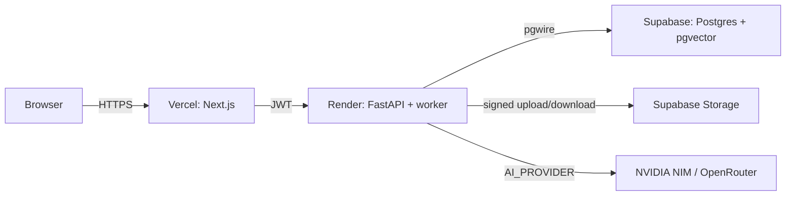

# Deployment

## 1. Target: $0 (MVP) with an escape hatch

| Component | MVP ($0) | Fallback if free tier fails |
|---|---|---|
| Frontend | Vercel Hobby (Next.js) | Cloudflare Pages / any static host; or a VPS |
| Backend | Render free web service (FastAPI + worker) | Railway free tier; or VPS (`~$5-6/mo`, Hetzner) |
| PostgreSQL + pgvector | Supabase free (hosted, paused after 7 days inactivity) | Neon free; or Postgres on the VPS |
| Auth | Supabase Auth (bundled) | DIY JWT (SQLAlchemy users + password hashing) |
| Storage | Supabase Storage free | Backblaze B2 (10 GB free); or local disk on VPS |
| AI | NVIDIA Build free endpoints | OpenRouter free models; swap via `AI_PROVIDER` |
| Domain + HTTPS | none needed in MVP (Vercel/Render give `*.onrender.com` + `*.vercel.app` with TLS) | `$10/yr` domain + Caddy/Traefik on VPS |

**Escape hatch:** every service behind an abstraction (see
[ai-providers.md](ai-providers.md)) or a plain env var (`DATABASE_URL`). If the demo
needs reliable uptime, the VPS path is one compose file away — no code changes.

## 2. Target topology (MVP)

- Next.js runs server-side API calls; the browser never holds backend credentials.
- FastAPI service also runs the DB-backed worker as a second process on the same
  instance (Render free allows one web + background workers via `render.yaml`).

## 3. Environment variables

| Var | Where | Notes |
|---|---|---|
| `SUPABASE_URL` | Vercel, Render | |
| `SUPABASE_JWT_SECRET` | Render only | JWT verification |
| `SUPABASE_SERVICE_ROLE_KEY` | Render only | backend storage ops |
| `DATABASE_URL` | Render | runtime role (RLS on) |
| `STORAGE_PROVIDER=supabase` | Render | `local` for dev |
| `AI_PROVIDER=nvidia` | Render | `openrouter` | `fake` |
| `NVIDIA_API_KEY` / `OPENROUTER_API_KEY` | Render | per provider |
| `FRONTEND_URL` | Render | CORS allowlist |
| `BACKEND_URL` | Vercel | server-side base URL |
| `LOG_LEVEL`, `RATE_LIMIT_*` | both | ops knobs |

Never commit real values; keep `.env.example` in the repo, secrets in the hosting
platforms' secret stores.

## 4. Migrations

- SQL migration files in `infrastructure/migrations/` (numbered `0001_*.sql`, …).
- Run via `alembic upgrade head` (or a 10-line runner) as a Render pre-deploy step.
- Never run migrations against Supabase with the runtime role — use the migration
  connection (`postgres` role / SQL editor in dev only).

## 5. CORS & production hardening

- FastAPI CORS: `allow_origins=[FRONTEND_URL]`, `allow_methods=GET,POST,PATCH,DELETE`,
  `allow_headers=Authorization,Content-Type,Idempotency-Key`; no wildcard with credentials.
- Next.js: CSP + `X-Content-Type-Options` headers in `next.config`; `httpOnly` cookie
  for the Supabase session when proxying auth server-side.
- Render service health check → `/healthz` (returns DB+provider connectivity booleans).

## 6. CI/CD

- GitHub Actions on push: `backend: ruff + mypy + pytest`; `frontend: tsc + eslint +
  next build`; fail fast.
- On merge to `main`: auto-deploy via Render webhooks + Vercel Git integration.
- Supabase schema changes: only through migration files reviewed in PRs (no ad-hoc SQL).

## 7. Observability in prod

Structured JSON logs from FastAPI/worker go to Render's log stream (free). Metrics:
Prometheus endpoint on the backend if desired; otherwise counters in logs. See
[observability.md](observability.md).

## 8. Known free-tier pitfalls (plan for them)

| Pitfall | Mitigation |
|---|---|
| Supabase project pauses after ~7 days idle | Keep a cron hit (`/healthz`) from a free scheduler; or accept a "wake" delay and mention it |
| Render free sleeps after ~15 min idle | Same cron approach; document expected cold start in README |
| NVIDIA free endpoints change/rate-limit | `AI_PROVIDER` switch; cache embeddings per content hash in DB (optional later) |
| Vercel serverless cold starts | Next.js API calls to Render are infrequent; acceptable |
| Storage egress limits | PDFs ≤ 10 MB, low usage in demo; monitor dashboard |
