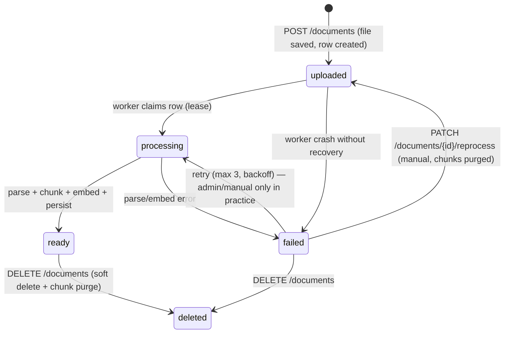
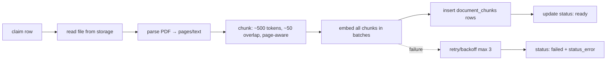

# Document Ingestion Pipeline

## 1. Lifecycle



States are stored in `documents.status` (`uploaded | processing | ready | failed | deleted`).

## 2. Synchronous vs asynchronous

- **Synchronous (API):** file size/type validation → storage upload → `documents` insert
  (status `uploaded`) → HTTP 201. Fast: this is all the client waits for.
- **Asynchronous (worker):** everything downstream. Required because parsing + embedding
  many chunks is slow (seconds to minutes). Blocks the request if done inline.
- For MVP, a **DB-backed worker** (see below) is sufficient. A real message queue
  (Redis/Celery/RabbitMQ) only becomes necessary when you need: durable retries across
  restarts with precise at-least-once semantics, priority/concurrency policies, or
  multiple worker types under load. Revisit at ~tens of thousands of processed docs/day.

## 3. DB-backed worker design

No Celery, no Redis. The Postgres table is the queue.

**Claim step (atomic):**
```sql
update documents
set status = 'processing',
    updated_at = now()
where id = :id
  and status = 'uploaded'          -- unclaimed only
  and (lease_until is null or lease_until < now())
returning id;
```

The worker:
1. Polls `documents where status = 'uploaded'` every few seconds (`SELECT … FOR UPDATE SKIP LOCKED`).
2. Sets a short `lease_until` (e.g. `now() + 5 min`) with a `lease_token` so a crashed
   worker's row can be re-claimed after the lease expires.
3. Runs the pipeline; on success marks `ready`; on failure increments a retry counter,
   and either schedules a retry (exponential backoff, max 3) or marks `failed` with
   `status_error` set.
4. Heartbeats the lease during long embeds so it isn't stolen mid-run.

Schema additions from the core schema (sandboxed in the worker CSV/table):
```sql
alter table documents add column lease_until timestamptz;
alter table documents add column retry_count int not null default 0;
```

In-process `asyncio` task or a separate CLI worker process (`python -m app.worker`) —
the same code, started from `docker compose` as an extra service. MVP runs one worker.

## 4. Pipeline steps



1. **Read** — fetch bytes from `StorageProvider` by `storage_path` (service credential).
2. **Parse** — `pypdf` extract text per page; keep `page_number` per chunk. Guard against
   empty text (scanned PDFs) → mark `failed` with a clear error.
3. **Chunk** — recursive splitting targeting ~500 tokens (~1200 chars for English prose),
   overlap ~50 tokens (~120 chars), never splitting across pages unless unavoidable;
   record the chunk's starting page. (Tune from eval — see [rag.md](rag.md) §5.)
4. **Embed** — `AIProvider.embed(batch)` in batches of 16–64 texts; each call failure
   retries with backoff.
5. **Persist** — bulk insert `document_chunks` rows with `document_id`, `chunk_index`,
   `content`, `page_number`, `token_count`, `metadata`, `embedding`.
6. **Finalize** — `documents.status = 'ready'`, `total_chunks = n`.

## 5. Policy decisions

| Policy | Value |
|---|---|
| Supported types | `application/pdf` only (MVP) |
| Max file size | 10 MB (validated at API + enforced by storage policy) |
| Max pages | None hard-coded; practical guard ~200 pages → soft warning (skip for MVP) |
| Duplicate files | No strict dedupe; uploading the same file twice creates two documents. Output-path collision is avoided because paths embed `document_id` |
| Document deletion | `DELETE /documents/{id}` → soft-delete row + delete chunks + delete file from storage. Conversations which referenced the doc remain, and their retrieval filter simply excludes the missing doc |
| Re-indexing | `PATCH /documents/{id}/reprocess` re-queues a `failed` document: status → `uploaded`, chunks purged, counters cleared — the existing worker re-runs the exact same pipeline (docs/api.md §2). Reprocessing `ready` documents stays out of MVP scope |
| Partial failures | Failures are per-document (parse/embed). Chunks are inserted in one transaction at step 5 → an embedding failure leaves the doc `failed` with no half-written chunks. If a document has zero valid pages, treat as parse failure |
| Retry | Max 3 attempts, exponential backoff (1s → 5s → 30s), then `failed` |

## 6. Observability hooks

Worker logs a structured line per stage with timings and token counts; embeds and the
worker loop emit counters (see [observability.md](observability.md)). `status_error` is
always persisted so failures are debuggable from the DB alone.