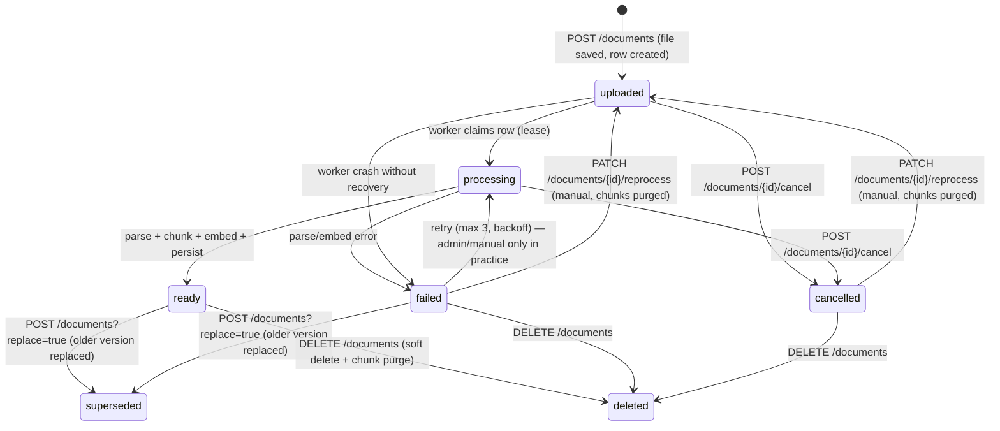
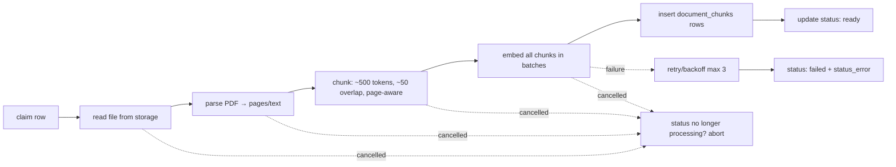

# Document Ingestion Pipeline

## 1. Lifecycle



States are stored in `documents.status`
(`uploaded | processing | ready | failed | superseded | deleted | cancelled`).
`superseded` rows remain listed in the docs table ("Outdated") but are excluded
from retrieval, conversation context, and worker claims (docs/database.md).

**Cancellation (`POST /documents/{id}/cancel`):** queued (`uploaded`) and
in-flight (`processing`) documents can be cancelled; the row flips to
`cancelled` and its lease is cleared. The status is the worker's stop signal —
the pipeline re-checks it between stages (after download, between every embed
batch, before persist) and aborts as soon as it is no longer `processing` with
`deleted_at` null, so a deleted or cancelled file never keeps burning
embedding requests and no chunks persist for it. A `cancelled` row is terminal
until the owner re-processes it or deletes it; it is excluded from the
duplicate check, so re-uploading the same file just works (new row, fresh
processing).

## 2. Synchronous vs asynchronous

- **Synchronous (API):** file size/type validation → storage upload → `documents` insert
  (status `uploaded`) → HTTP 201. Fast: this is all the client waits for.
- **Asynchronous (worker):** everything downstream. Required because parsing + embedding
  many chunks is slow (seconds to minutes). Blocks the request if done inline.
- For MVP, a **DB-backed worker** (see below) is sufficient. A real message queue
  (Redis/Celery/RabbitMQ) only becomes necessary when you need: durable retries across
  restarts with precise at-least-once semantics, priority/concurrency policies, or
  multiple worker types under load. Revisit at ~tens of thousands of processed docs/day.

## 3. DB-backed worker design

No Celery, no Redis. The Postgres table is the queue.

**Claim step (atomic):**
```sql
update documents
set status = 'processing',
    updated_at = now()
where id = :id
  and status = 'uploaded'          -- unclaimed only
  and (lease_until is null or lease_until < now())
returning id;
```

The worker:
1. Polls `documents where status = 'uploaded'` every few seconds (`SELECT … FOR UPDATE SKIP LOCKED`).
2. Sets a short `lease_until` (e.g. `now() + 5 min`) with a `lease_token` so a crashed
   worker's row can be re-claimed after the lease expires.
3. Runs the pipeline; on success marks `ready`; on failure increments a retry counter,
   and either schedules a retry (exponential backoff, max 3) or marks `failed` with
   `status_error` set.
4. Heartbeats the lease during long embeds so it isn't stolen mid-run.

Schema additions from the core schema (sandboxed in the worker CSV/table):
```sql
alter table documents add column lease_until timestamptz;
alter table documents add column retry_count int not null default 0;
```

In-process `asyncio` task or a separate CLI worker process (`python -m app.worker`) —
the same code, started from `docker compose` as an extra service. MVP runs one worker.

## 4. Pipeline steps



1. **Read** — fetch bytes from `StorageProvider` by `storage_path` (service credential).
2. **Parse** — `pypdf` extract text per page; keep `page_number` per chunk. Guard against
   empty text (scanned PDFs) → mark `failed` with a clear error. C0 control characters
   (NUL etc.) from broken PDF encodings are replaced with spaces — Postgres text columns
   cannot store NUL, and they act as word separators.
3. **Chunk** — recursive splitting targeting ~500 tokens (~1200 chars for English prose),
   overlap ~50 tokens (~120 chars), never splitting across pages unless unavoidable;
   record the chunk's starting page. (Tune from eval — see [rag.md](rag.md) §5.) The
   window is clamped to the embedding provider's input cap (`embedding_max_input_tokens`
   × 1.4 chars/token floor — [ai-providers.md](ai-providers.md) §2): code/math-heavy
   text tokenizes denser than the 2.4 chars/token prose estimate (~1.6 measured on
   code books), so the clamp keeps
   chunks under the vendor's hard limit (e.g. ~298 estimated-token windows for
   `nv-embedqa-e5-v5`'s 512-token cap) instead of failing with a vendor 400.
4. **Embed** — `AIProvider.embed(batch)` in batches of 16–64 texts; each call failure
   retries with backoff. Over-cap inputs are truncated as a last-resort backstop; any
   text that still draws a deterministic 4xx (except 429) fails the document
   permanently (no pointless retries — [ai-providers.md](ai-providers.md) §4).
   The pipeline drives the batches itself and re-checks the row's status between
   batches, aborting the run if the owner cancelled or deleted the document.
5. **Persist** — bulk insert `document_chunks` rows with `document_id`, `chunk_index`,
   `content`, `page_number`, `token_count`, `metadata`, `embedding`.
6. **Finalize** — `documents.status = 'ready'`, `total_chunks = n`.

## 5. Policy decisions

| Policy | Value |
|---|---|
| Supported types | `application/pdf` only (MVP) |
| Max file size | 10 MB (validated at API + enforced by storage policy) |
| Max pages | None hard-coded; practical guard ~200 pages → soft warning (skip for MVP) |
| Duplicate files | Per (user, filename) dedupe: an upload colliding with an active row → `409` (docs/api.md §2). `cancelled` rows are excluded from the dedupe (they hold no chunks), so re-uploading a cancelled file just works. The client offers **update** (`POST /documents?replace=true`) or upload under a **new name** (client pre-fills a suggested `name-2.pdf`). Update is reversible: the old row is marked `superseded` immediately (leaves the chat corpus, stays in the table) but keeps its chunks and remembers its previous status; if the replacement reaches `ready` the supersede is finalized (chunks purged), and if it `fails` or is deleted the old document is restored to its previous status (migration 0005 trigger, docs/database.md). The partial unique index `documents_active_filename_idx` enforces this against parallel-upload races |
| Document deletion | `DELETE /documents/{id}` → soft-delete row + delete chunks (and their embeddings, which live on `document_chunks.embedding`) + delete file from storage. A deletion mid-processing is the worker's stop signal — the in-flight run aborts at the next stage poll. Conversations which referenced the doc remain, and their retrieval filter simply excludes the missing doc |
| Cancellation | `POST /documents/{id}/cancel` stops a queued/in-flight document: status → `cancelled`, lease cleared; the worker aborts at the next stage poll (docs/ingestion.md §1) |
| Re-indexing | `PATCH /documents/{id}/reprocess` re-queues a `failed` **or `cancelled`** document: status → `uploaded`, chunks purged, counters cleared — the existing worker re-runs the exact same pipeline (docs/api.md §2). Reprocessing `ready` documents stays out of MVP scope |
| Replace uploads | `POST /documents?replace=true` marks the old version `superseded` (previous status kept in `superseded_from`, chunks kept) and inserts the replacement with `replaces_document_id` linking back. The `documents_replace_resolution` trigger (migration 0005) resolves the outcome atomically with the worker's transaction: replacement `ready` → old finalized (superseded, chunks purged); replacement `failed` → the failed row leaves the active set, old restored to `superseded_from`; replacement deleted before resolving → old restored the same way |
| Partial failures | Failures are per-document (parse/embed). Chunks are inserted in one transaction at step 5 → an embedding failure leaves the doc `failed` with no half-written chunks. If a document has zero valid pages, treat as parse failure |
| Retry | Max 3 attempts, exponential backoff (1s → 5s → 30s), then `failed` |

## 6. Observability hooks

Worker logs a structured line per stage with timings and token counts; embeds and the
worker loop emit counters (see [observability.md](observability.md)). `status_error` is
always persisted so failures are debuggable from the DB alone.